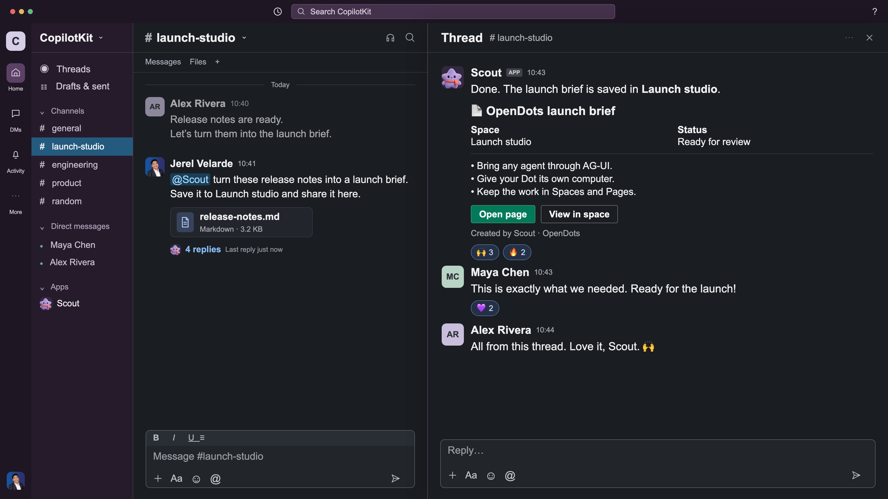

# Slack thread demo footage

A standalone Remotion composition for the OpenDots launch: a request starts in a Slack channel, Scout reads release notes and saves a launch brief, and teammates respond in the same thread. Scout’s generated messages use familiar Block Kit sections, fields, dividers and actions.

**This is an authored UI mock, not a recording of a live Slack integration.** All conversation content, task progress, page results, replies and reactions are illustrative. No Slack credentials or connected services are required.



[Watch or download the 4K MP4](../../docs/demos/slack-thread-raw-4k.mp4).

## Run and edit

Use Node.js 24 and npm. This project has its own dependency lockfile and does not change the application’s dependencies.

```sh
cd video/slack-thread
npm ci
npm run typecheck
npm run studio
```

Select **OpenDots-Slack-Thread** in Studio. Edit `src/SlackDotDemo.tsx`: `B` controls the timing, `W` controls the layout, and `WorkBlocks` / `PageBlocks` define Scout’s generated UI.

## Render

```sh
npm run render:1080p
npm run render:4k
npm run render:prores
npm run still
```

Exports go into the ignored `out/` directory. The composition is **31 seconds, 930 frames, 30 fps, 16:9, and silent**. The MP4 and ProRes commands render at 3840×2160 directly from the composition. ProRes uses the Standard/422 profile with `yuv422p10le`; this is an editing format, not additional source color detail. The 1080p command renders a separate viewing copy.

The mock UI fills the frame without an outer OpenDots logo, tagline, backdrop, frame border or footer. OpenDots references inside the conversation remain. There are no camera crops, music or promotional overlays. The original in-frame mock disclosure was removed for clean editor footage; keep this README with the exports to preserve its provenance.

## Timing

| Time        | Action                                                     |
| ----------- | ---------------------------------------------------------- |
| 0–4.2 s     | Type a request to Scout in #launch-studio.                 |
| 4.2–6.4 s   | Send release-notes.md and open the reply thread.           |
| 6.9–14.3 s  | Scout reads, drafts and saves a Page.                      |
| 15.5–20.3 s | Scout shares the result with Block Kit fields and buttons. |
| 20.3–23.8 s | Maya and Alex reply in the thread.                         |
| 26.6–31 s   | Reactions arrive and the final state holds.                |

## Editor handoff

Provide the 4K ProRes master, 4K MP4, 1080p copy, final-state PNG, this README and the editable project. The compact 4K MP4 is included in `docs/demos/slack-thread-raw-4k.mp4`. Regenerated `out/` files, ProRes masters and editor archives are excluded from Git. This standalone Slack clip is an additional raw asset; it does not contain the full launch film.

## Assets and provenance

The Slack chrome and cursor conventions were adapted from the supplied OpenTag Slack demo reference. `public/assets/slack-demo/jerel.png` is the supplied avatar, and `public/assets/opendots-original-cast.png` is the original OpenDots mascot sheet; Scout uses its fourth character. The remaining UI is drawn as React/CSS/SVG. The component styling follows [Slack Block Kit](https://docs.slack.dev/block-kit/), but the buttons and task statuses are animation elements rather than working Slack API controls.

Arial/Helvetica/system sans-serif are used; no font binary is required. Platform emoji and font rendering can vary slightly across operating systems.
